# UI Testing Project with Playwright and Cucumber

A beginner-friendly UI automation project in this repository.

## Repository Description

This repository demonstrates a complete, minimal UI test automation workflow using Playwright directly and through Cucumber BDD.
It includes a simple static web app (`demo-app/`), a Playwright test suite (`tests/ui.spec.js`), and a Cucumber test suite (`features/`) that validate core user behavior:

- page render and heading visibility,
- guest greeting when input is empty,
- personalized greeting when a name is provided.

The project is intended for learning, demo, and starter-template use cases where teams need a fast way to understand Playwright setup, Cucumber workflow, local app hosting for tests, and reporting.

This project demonstrates:

- Playwright end-to-end UI testing
- Cucumber BDD scenarios with Playwright underneath
- Auto-starting a local static app before tests
- HTML reporting with Playwright

---

## Quick Start

Run from repository root:

```bash
cd ui-playwright-tests
npm install
npx playwright install chromium
npm run test:ui
```

Run the Cucumber suite:

```bash
npm run test:bdd
```

After execution, open the HTML report:

```bash
npm run report
```

---

## 1) Project Structure

- `demo-app/` → Static UI used for test automation
- `tests/` → Playwright test specs
- `features/` → Cucumber BDD feature files, hooks, and step definitions
- `playwright.config.js` → Playwright runner configuration
- `package.json` → Scripts and dependencies

---

## 2) What Is Used

- Node.js 20+
- `@playwright/test`
- `@cucumber/cucumber`
- `http-server` to host the demo UI during test execution

---

## 3) Prerequisites

1. Node.js 20 or newer
2. npm

Verify:

```bash
node -v
npm -v
```

---

## 4) Install Dependencies

```bash
cd ui-playwright-tests
npm install
```

Install browser binaries used by Playwright:

```bash
npx playwright install chromium
```

---

## 5) Run Tests

### Playwright test runner

Headless run:

```bash
npm run test:ui
```

Headed run:

```bash
npm run test:ui:headed
```

Debug mode:

```bash
npm run test:ui:debug
```

### Cucumber BDD suite

Run all Cucumber scenarios:

```bash
npm run test:bdd
```

Run smoke scenarios only:

```bash
npm run test:bdd:smoke
```

Run regression scenarios excluding `@negative`:

```bash
npm run test:bdd:regression
```

---

## 6) Reports and Artifacts

Playwright creates:

- `playwright-report/` → HTML report
- `test-results/` → traces/screenshots/videos for failed tests

Cucumber in this repo uses console output formats defined in `cucumber.js` (`progress` and `summary`).

Open report:

```bash
npm run report
```

---

## 7) Included Example Test Cases

Current sample suite includes:

1. Verify page heading is visible
2. Verify empty input returns `Hello, Guest!`
3. Verify typed input returns personalized greeting

---

## 8) Troubleshooting

### Browser not installed error

```bash
npx playwright install chromium
```

### Port `4173` already in use

Stop the process using that port, then run tests again.

### `npm` command not found

Install Node.js and restart terminal.

---

## 9) Next Improvements

- Add cross-browser projects (Firefox/WebKit)
- Add GitHub Actions workflow for UI test execution
- Add visual regression snapshots

---

## 10) Requirements and Test Case Documentation

- App requirements: `docs/app-requirements.md`
- UI test cases: `docs/ui-test-cases.md`

---

## 11) How the App Was Tested

Testing was executed in two modes:

1. Direct Playwright execution using the Chromium project configured in `playwright.config.js`.
2. Cucumber BDD execution using Gherkin feature files and Playwright browser automation underneath.

### Test approach

- The static app in `demo-app/` is hosted on port `4173` during test execution.
- Direct Playwright tests are implemented in `tests/ui.spec.js` and run against `http://127.0.0.1:4173`.
- Cucumber scenarios are implemented in `features/greeting.feature` and mapped to Playwright-backed step definitions.
- Assertions cover page render and greeting behavior for both empty and non-empty input.

### Commands used

```bash
npm install
npx playwright install chromium
npm run test:ui
npm run test:bdd
```

### Executed checks

1. Home page heading is visible.
2. Empty name input returns `Hello, Guest!`.
3. Entered name returns personalized greeting (example: `Hello, Rahul!`).

### Evidence and artifacts

- Playwright console list reporter output during execution.
- Playwright HTML report generated in `playwright-report/`.
- Retry artifacts (trace, screenshot, video on failure) in `test-results/`.
- Cucumber console progress and summary output for BDD execution.

---

## 12) BDD with Cucumber

This repository also supports BDD-style tests using Cucumber + Playwright.

### Playwright content in this repo

The repository contains both pure Playwright content and Cucumber scenarios that use Playwright underneath.

| Area | Main files | Purpose |
|---|---|---|
| Pure Playwright | `playwright.config.js`, `tests/ui.spec.js`, `package.json` scripts like `test:ui` | Run UI tests directly with the Playwright test runner |
| Cucumber + Playwright | `cucumber.js`, `features/greeting.feature`, `features/step_definitions/greeting.steps.js`, `features/support/hooks.js`, `features/support/world.js` | Write scenarios in Gherkin and execute them through Playwright browser automation |

In other words, Playwright is used in two ways here:

1. As the main test runner for `tests/ui.spec.js`.
2. As the browser automation engine under the Cucumber BDD layer.

### Cucumber workflow in this repo

The practical workflow is:

1. A tester or BA writes business-readable scenarios in Gherkin in `features/greeting.feature`.
2. Cucumber reads `cucumber.js` to discover support files and step definitions.
3. Hooks in `features/support/hooks.js` prepare the browser and app server.
4. Cucumber matches each `Given`/`When`/`Then` step to a JavaScript function in `features/step_definitions/greeting.steps.js`.
5. Those step-definition functions use Playwright to interact with the UI and make assertions.
6. Hooks clean up the browser context after each scenario and close shared resources after the suite.

In short:

`Gherkin scenario` -> `Cucumber step match` -> `step definition` -> `Playwright action/assertion`

```mermaid
flowchart LR
	A[Tester writes Gherkin\nfeatures/greeting.feature] --> B[Cucumber reads cucumber.js]
	B --> C[Load hooks, world,\nand step definitions]
	C --> D[BeforeAll starts server\nand browser]
	D --> E[Before creates fresh\ncontext and page]
	E --> F[Match Given/When/Then\nto greeting.steps.js]
	F --> G[Playwright interacts\nwith the UI]
	G --> H[Assertions validate\nexpected result]
	H --> I[After closes context]
	I --> J[AfterAll closes browser\nand server]
```



### How Cucumber is used in this repo

1. Business scenarios are written in Gherkin in `features/greeting.feature`.
2. Each Gherkin step is implemented in JavaScript step definitions in `features/step_definitions/greeting.steps.js`.
3. Cucumber hooks in `features/support/hooks.js` manage lifecycle:
	- ensure the demo app server is available on port `4173`,
	- launch Playwright Chromium before the suite,
	- create a fresh browser context/page per scenario,
	- close context and browser after execution.
4. Shared scenario state (`page`, `context`, `browser`) is stored in `features/support/world.js`.
5. Cucumber runtime wiring is defined in `cucumber.js`.

### Scenario traceability

- `TC-001` in feature file verifies heading visibility.
- `TC-002` in feature file verifies guest greeting for empty input.
- `TC-003` in feature file verifies personalized greeting for entered name.

These scenario IDs match the documented test cases in `docs/ui-test-cases.md`.

### Execution flow

When you run `npm run test:bdd`, Cucumber executes this sequence:

1. Load support files and step definitions from `cucumber.js`.
2. Run `BeforeAll` hook to prepare server/browser.
3. For each scenario, run `Before` hook, scenario steps, then `After` hook.
4. Run `AfterAll` hook to close remaining resources.

### From Gherkin step to Playwright code

This is the exact lifecycle for one step in this repository:

1. Cucumber reads a step from `features/greeting.feature`, for example:

```gherkin
When I enter the name "Rahul"
```

2. Cucumber searches the loaded step-definition files for a matching expression.
3. It finds this implementation in `features/step_definitions/greeting.steps.js`:

```js
When("I enter the name {string}", async function (name) {
	await this.page.locator("#name-input").fill(name);
});
```

4. The value `Rahul` is passed into the `name` argument.
5. `this.page` comes from the Cucumber World created in `features/support/world.js` and initialized in the `Before` hook in `features/support/hooks.js`.
6. Playwright fills the input field in the browser.
7. A later `Then` step reads UI output and validates the result with an assertion.

That means Gherkin is the readable specification, but the JavaScript step definition is what makes the scenario executable.

### Roles a tester can play with Cucumber

A tester can contribute at multiple levels depending on technical depth:

1. Specification role: write and review Gherkin scenarios, examples, tags, and acceptance coverage.
2. Functional test design role: define happy paths, edge cases, negative cases, and traceability to requirements.
3. Execution and analysis role: run suites, filter by tags, inspect failures, and report defects.
4. Automation role: write or maintain step definitions, assertions, hooks, and Playwright interactions.

So a tester does not have to only use Gherkin. A non-technical tester may work mostly in feature files, but a technical tester or SDET often writes both Gherkin and the underlying automation code.

### Who writes the underlying code?

Gherkin alone is not executable. Someone must implement the step definitions and automation code.

Common team models are:

1. Manual tester or BA writes Gherkin, and an automation tester/SDET writes the step definitions.
2. Tester and developer collaborate, with the developer implementing some or all step definitions.
3. A technical tester owns both the Gherkin and the automation layer.

In this repository, the underlying executable code is mainly:

- `features/step_definitions/greeting.steps.js` for step implementations
- `features/support/hooks.js` for setup and teardown
- `features/support/world.js` for shared scenario state

### What a newbie tester should learn first

If you are new to Cucumber, the most useful order is:

1. Learn to write good Gherkin: keep steps clear, behavior-focused, and non-technical.
2. Learn how step definitions map Gherkin sentences to executable code.
3. Learn basic Playwright automation so you can understand and eventually maintain the underlying implementation.
4. Learn hooks, tags, and test data patterns so you can scale scenarios without duplication.

This progression helps you move from specification writing to full test automation without treating Cucumber as only a documentation tool.

### Run BDD suite

```bash
npm run test:bdd
```

Run smoke-only BDD scenarios:

```bash
npm run test:bdd:smoke
```

Run full regression-tagged BDD scenarios:

```bash
npm run test:bdd:regression
```

This regression command runs scenarios tagged `@regression` and excludes scenarios tagged `@negative`.

### BDD structure

- `features/greeting.feature` → business-readable scenarios
- `features/step_definitions/greeting.steps.js` → step implementations
- `features/support/hooks.js` → browser/server lifecycle hooks
- `features/support/world.js` → shared Cucumber world state

### Notes

- Cucumber hooks start the demo app server on port `4173` if it is not already running.
- Browser automation is performed with Playwright Chromium.
- Tags are included in `features/greeting.feature` (`@smoke`, `@regression`) for selective execution.
- The intentional failing demo scenario is tagged `@negative`.
